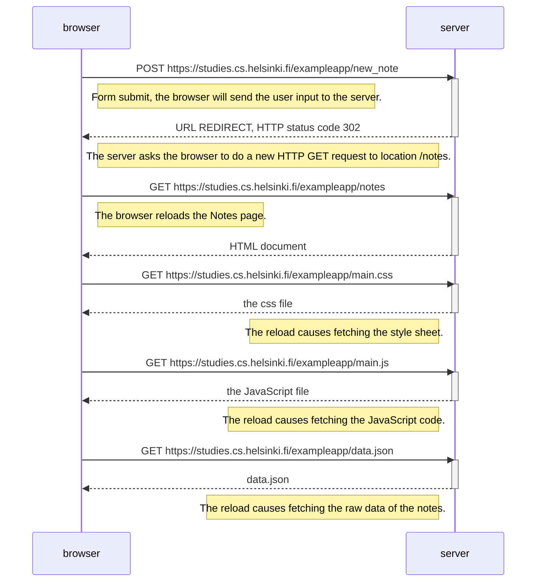

```mermaid
sequenceDiagram
    participant browser
    participant server

    browser->>server: POST https://studies.cs.helsinki.fi/exampleapp/new_note
    activate server
    Note right of browser : Form submit, the browser will send the user input to the server.
    server-->>browser:URL REDIRECT, HTTP status code 302
    deactivate server
    Note left of server : The server asks the browser to do a new HTTP GET request to location /notes.
    
    
    browser->>server: GET https://studies.cs.helsinki.fi/exampleapp/notes
    activate server
    Note right of browser :The browser reloads the Notes page.
    server-->>browser: HTML document
    deactivate server

    browser->>server: GET https://studies.cs.helsinki.fi/exampleapp/main.css
    activate server
    server-->>browser: the css file
    deactivate server
    Note left of server : The reload causes fetching the style sheet.
    

    browser->>server: GET https://studies.cs.helsinki.fi/exampleapp/main.js
    activate server
    server-->>browser: the JavaScript file
    deactivate server
    Note left of server : The reload causes fetching the JavaScript code.


    browser->>server: GET https://studies.cs.helsinki.fi/exampleapp/data.json
    activate server
    server-->>browser: data.json
    deactivate server
    Note left of server : The reload causes fetching the raw data of the notes.
```