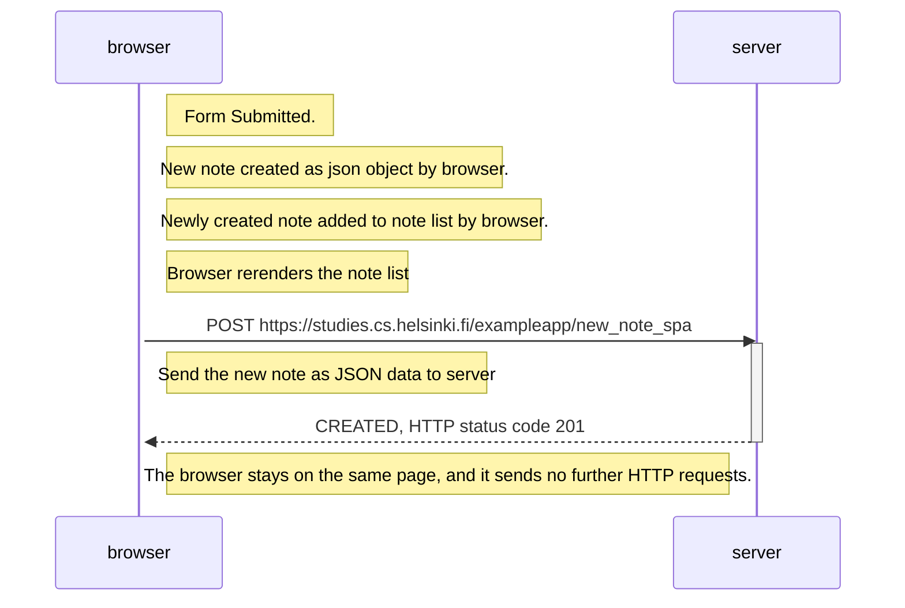

```mermaid
sequenceDiagram
    participant browser
    participant server
    activate browser
    Note right of browser : Form Submitted.
    Note right of browser : New note created as json object by browser.
    Note right of browser : Newly created note added to note list by browser.
    Note right of browser : Browser rerenders the note list

    browser->>server: POST https://studies.cs.helsinki.fi/exampleapp/new_note_spa
    activate server
    Note right of browser : Send the new note as JSON data to server
    server-->>browser:CREATED, HTTP status code 201
    deactivate server
    Note right of browser : The browser stays on the same page, and it sends no further HTTP requests.
```